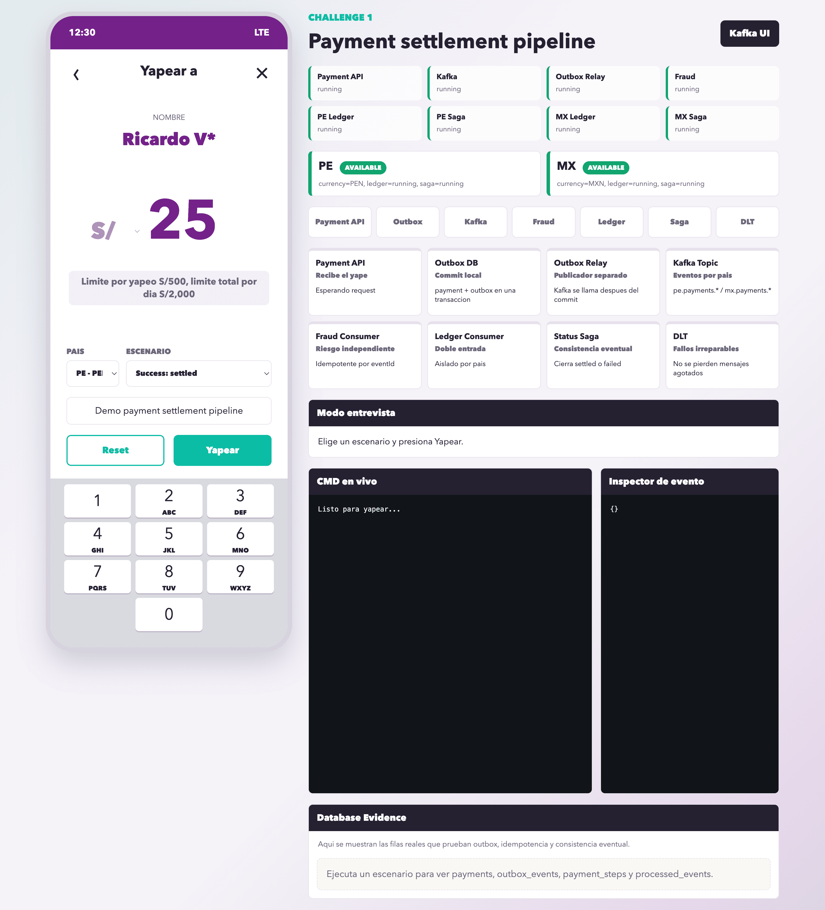

# Run local con Docker

Esta guía explica el flujo más simple para levantar y limpiar el proyecto usando los scripts incluidos.

## Requisito

Solo necesitas tener Docker Desktop instalado y corriendo.

## Iniciar el proyecto

Desde la raíz del proyecto ejecuta:

```bash
./scripts/init-local.sh
```

El script te irá preguntando:

```text
Use default DB password?
Add SUPPORTED_COUNTRIES?
Currency for pe?
Currency for mx?
Enable Kafka UI?
Enable Visual Demo?
Start Docker services now?
```

Para una primera corrida recomendada puedes usar:

```text
SUPPORTED_COUNTRIES=pe,mx
pe -> PEN
mx -> MXN
Kafka UI -> yes
Visual Demo -> yes
Start Docker services -> yes
```

Al finalizar deberías ver URLs similares a:

```text
Payment API : http://localhost:3000
Kafka broker: localhost:9092
Postgres    : localhost:5432
Kafka UI    : http://localhost:8080
Visual Demo : http://localhost:4000
```

## Qué levanta el init

El script levanta el stack core:

```text
postgres
kafka
topic-init
payment-api
outbox-relay
fraud-consumer
```

Y levanta workers aislados por país:

```text
yape-pe: ledger-consumer, status-saga
yape-mx: ledger-consumer, status-saga
```

Si configuraste más países, creará un proyecto Docker por cada país:

```text
yape-co
yape-cl
yape-ar
```

## Ver el demo visual

Abre:

```text
http://localhost:4000
```

Escenarios recomendados para probar:

```text
Success: settled
Fraud rejected: failed
Ledger down + retry
Timeout: pending honesto
DLT: payload invalido
Replay: idempotencia
MX caido, PE disponible
```

## Ver Kafka UI

Abre:

```text
http://localhost:8080
```

Ahí puedes ver topics como:

```text
pe.payments.payment.created.v1
mx.payments.payment.created.v1
pe.payments.payment.created.v1.dlt
mx.payments.payment.created.v1.dlt
```

## Borrar todo el Docker del proyecto

Si quieres limpiar el laboratorio y volver a correr el init desde cero:

```bash
./scripts/cleanup-docker.sh
```

El script mostrará un resumen de lo que va a eliminar:

```text
containers
networks
volumes
imagenes locales del proyecto
```

Para evitar borrados accidentales, te pedirá escribir exactamente:

```text
CONFIRM
```

Después de limpiar, puedes volver a iniciar todo con:

```bash
./scripts/init-local.sh
```

## Cuándo usar cada script

Usa `init-local.sh` cuando quieras:

```text
crear .env inicial
crear .env.pe / .env.mx
configurar monedas por país
levantar Docker
abrir Kafka UI y Visual Demo
```

Usa `cleanup-docker.sh` cuando quieras:

```text
apagar todo el proyecto
borrar volúmenes de Postgres/Kafka
probar el bootstrap desde cero
cambiar países o monedas desde cero
```

## Nota importante

`cleanup-docker.sh` está diseñado para borrar recursos de este proyecto, no todo tu Docker local. Aun así, revisa el preview antes de escribir `CONFIRM`.
